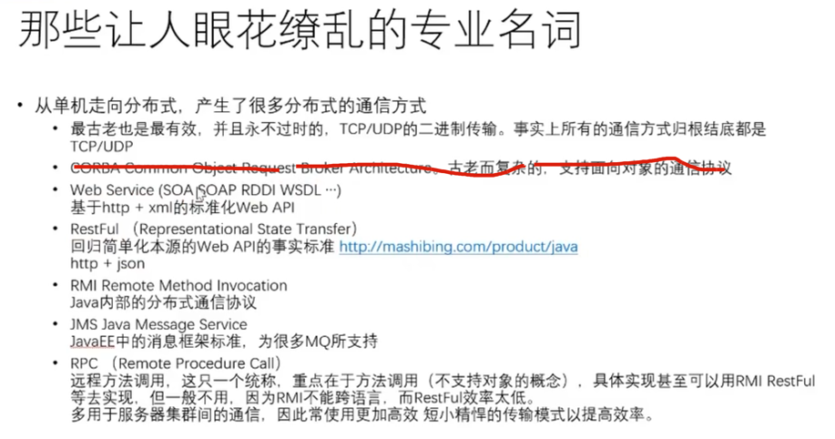

#哪些让人眼花缭乱的专业名词

* 从单机走向分布式，产生了很多分布式的通信方式
    1，最古老也最有效，并且永不过时的，TCP/UDP的二进制传输，事实上所有的通信方式归根结底都是TCP/UDP
    2，web service （SOA SOAP RDDI WSDL ...）
        基于http + xml 的标准化Web API
  
    3,RestFul 回归简单化本源的Web API的事实标准
        http + json
  
    4， RPC(远程过程调用) :  本质是一种通信方式
        有多种方式可以实现。
    5， RMI（remote method invocation）: 是RPC针对java的一种是实现

#RPC通信协议：
1， http  （只支持文本）
2， http2.0
3，TCP
    同步、异步 阻塞、非阻塞
4，webservice

